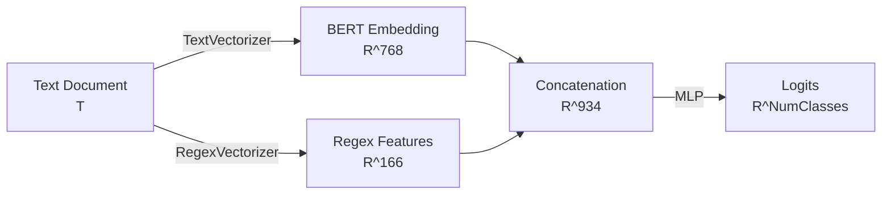

# Kadaster Dataloader

A utility for loading and processing Kadaster datasets, specifically designed for handling "rechtsfeitcodes" with label encoding.

## Features

- **Dataset Loading**: Efficiently loads JSONL datasets using Hugging Face `datasets`.
- **Label Encoding**: Handles sparse integer codes, mapping them to dense indices.
- **Unknown Handling**: Robustly handles unknown codes by mapping them to a reserved index (0).
- **Logging**: Uses `loguru` for structured logging to both console and file (`logs/dataset.log`).
- **PyTorch Integration**: Provides a custom `Dataset` and `DataLoader` for PyTorch.

## Usage

### 1. Analysis
Generate a label distribution plot to understand the dataset balance.
```bash
uv run python main.py analyze
```
Output: `artifacts/img/label_distribution.png`

### 2. Regex Evaluation
Evaluate the performance of the regex-based model on the training set.
```bash
uv run python main.py evaluate-regex
```
Output: `artifacts/csv/regex_evaluation.csv`

### 3. Training
Train the model. You can choose between the simple BERT classifier or the Hybrid model.

**Simple Classifier (BERT only):**
```bash
uv run python main.py train --model-class SimpleClassifier --epochs 5
```

**Hybrid Classifier (BERT + Regex):**
```bash
uv run python main.py train --model-class HybridClassifier --epochs 5
```

## Architecture

The system uses a **Hybrid Architecture** that combines deep learning embeddings with symbolic regex features.

### Category-Theoretic View

We can view the models as functors mapping from the space of text documents $\mathcal{T}$ to vector spaces $\mathbb{R}^d$.



1.  **Text Vectorizer**: Maps text to a dense semantic space.
    $$ f_{bert}: \mathcal{T} \to \mathbb{R}^{768} $$
2.  **Regex Vectorizer**: Maps text to a sparse symbolic space (binary features).
    $$ f_{regex}: \mathcal{T} \to \{0, 1\}^{166} $$
3.  **Hybrid Combination**: We construct a product space by concatenating the vectors.
    $$ f_{hybrid}(t) = f_{bert}(t) \oplus f_{regex}(t) \in \mathbb{R}^{768+166} $$
4.  **Classification**: A Multi-Layer Perceptron (MLP) maps the combined features to class probabilities.
    $$ f_{mlp}: \mathbb{R}^{934} \to [0, 1]^{NumClasses} $$
curl -sSL https://raw.githubusercontent.com/raoulg/private-data-hosting/refs/heads/main/download_data.sh | bash -s -- -o data/raw